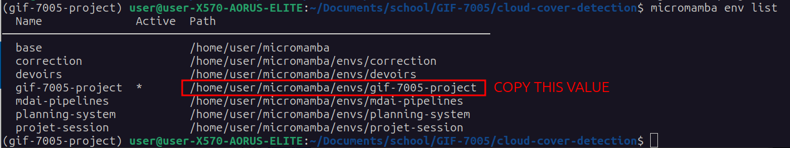
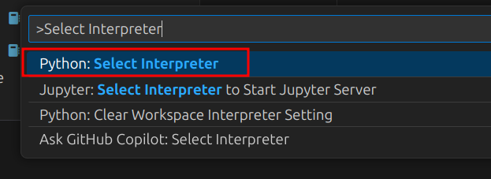
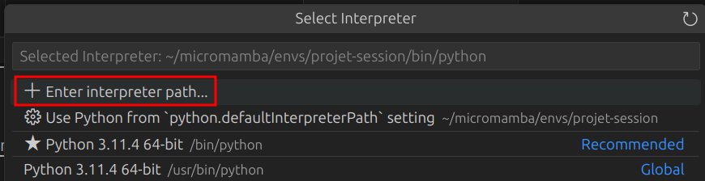
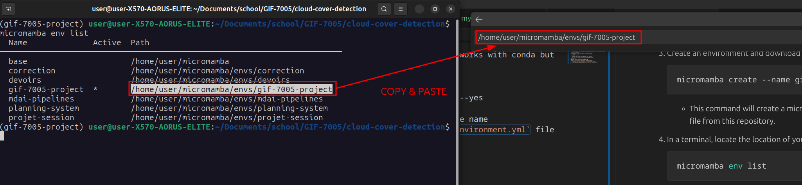
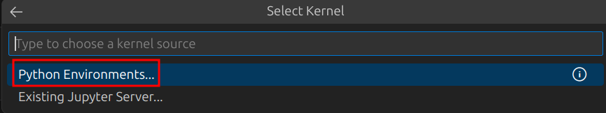
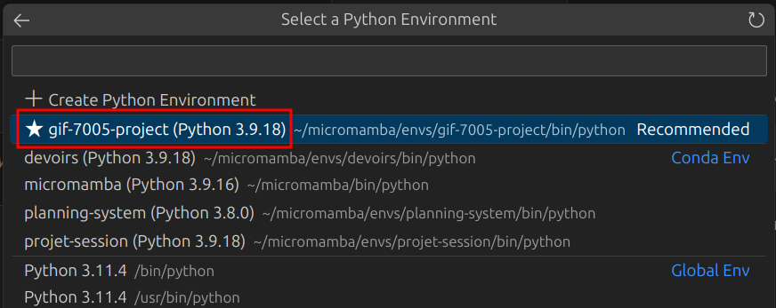
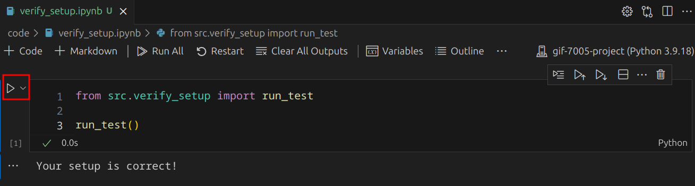

# Cloud Cover Detection Challenge  
In many uses of multispectral satellite imagery, clouds obscure what we really care about - for example, tracking wildfires, mapping deforestation, or monitoring crop health. Being able to more accurately remove clouds from satellite images filters out interference, unlocking the potential of a vast range of use cases. With this goal in mind, this training dataset was generated as part of [crowdsourcing competition](https://www.drivendata.org/competitions/83/cloud-cover/).

# How To Get Started
1. Download VSCode : https://code.visualstudio.com/download
1. Download micromamba : https://mamba.readthedocs.io/en/latest/micromamba-installation.html
   1. Note : The project dependencies are in conda format so it also works with conda but micromamba is faster and the selected tool for the team.
1. Create an environment and download the project dependencies.   
    ```shell
    micromamba create --name gif-7005-project --file environment.yml --yes    
    ```   
    - This command will create a micromamba/conda environment with the name `gif-7005-project` and download all the dependencies using the `environment.yml` file from this repository.
1. In a terminal, locate the path of your environment.  
    ```shell
    micromamba env list
    ```
    - Copy the path of the environment you just created.
    

1. Open VSCode.
1. Open the command palette (Ctrl + Shift + P).
1. Type `Select interpreter` and select the Python option.
    - 
1. Click on "Enter interpreter path..."
    - 
1. Copy & paste the path of your environment to the textbox in VSCode.
    - 
1. Press enter to confirm the path in VSCode.
1. Open the `code/verify_setup.ipynb` notebook and click on "Select Kernel"
    - 
1. Click on "Python Environments..."
    - 
1. Select your micromamba environment (here `gif-7005-project`)
    - 
1. Run the notebook cell to confirm that your setup is correct.
    - 

## Linux Specific
- Add this to your `~/.bashrc`:  
```
export LD_LIBRARY_PATH=/home/user/micromamba/envs/gif-7005-project/lib/:$LD_LIBRARY_PATH
```
  - This is done to ensure that python uses libstdc++ from the conda environment. 

# How To Download The Data
1. See [appropriate README](data/README.md)