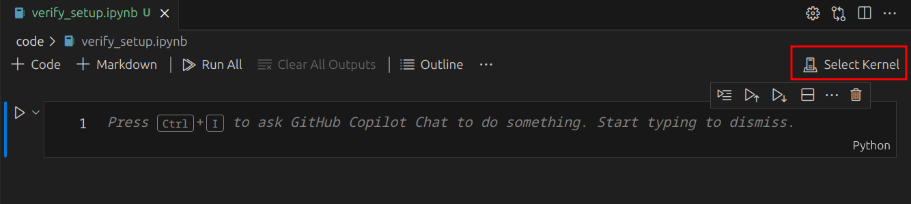

# Cloud Cover Detection Challenge  
[See challenge details](https://www.drivendata.org/competitions/83/cloud-cover/page/396/)

# How To Get Started
1. Download VSCode : https://code.visualstudio.com/download
1. Download micromamba : https://mamba.readthedocs.io/en/latest/micromamba-installation.html
   1. Note : The project dependencies are in conda format so it also works with conda but micromamba is faster and the selected tool for the team.
1. Create an environment and download the project dependencies.   
    ```shell
    micromamba create --name gif-7005-project --file environment.yml --yes    
    ```   
    - This command will create a micromamba/conda environment with the name `gif-7005-project` and download all the dependencies using the `environment.yml` file from this repository.
2. In a terminal, locate the path of your environment.  
    ```shell
    micromamba env list
    ```
    - Copy the path of the environment you just created.
    

3. Open VSCode.
4. Open the command palette (Ctrl + Shift + P).
5. Type `Select interpreter` and select the Python option.
    - 
6. Click on "Enter interpreter path..."
    - 
7. Copy & paste the path of your environment to the textbox in VSCode.
    - 
8. Press enter to confirm the path in VSCode.
9. Open the `code/verify_setup.ipynb` notebook and click on "Select Kernel"
    - 
10. Click on "Python Environments..."
    - 
11. Select your micromamba environment (here `gif-7005-project`)
    - 
12. Run the notebook cell to confirm that your setup is correct.
    - 