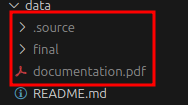

# How To Download The Data
1. Download AzCopy : https://learn.microsoft.com/en-us/azure/storage/common/storage-use-azcopy-v10
1. Visit [the data repository](https://beta.source.coop/repositories/radiantearth/cloud-cover-detection-challenge/download/)
1. Click "GENERATE CREDENTIALS"
1. Open the terminal under the `data/` folder of this (local) repository.
1. Download the data using AzCopy.  
   Copy the command from the page where you clicked "Generate credentials", it should look like this : 
    ```shell
    azcopy sync https://radiantearth.blob.core.windows.net/mlhub/ref_cloud_cover_detection_challenge_v1 . --recursive=true
    ```  

You should have the following in your `data/` folder once all the files are downloaded :  
